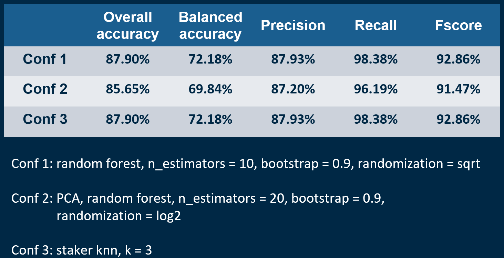

# Intrusion-detection
KDD process to mine patterns for intrusion detection
### Index

1. [**What is**](#what-is)
2. [**System Dependencies**](#requirements-and-dependencies)
3. [**Quick Start**](#quick-start)
4. [**Dataset**](#Dataset)
5. [**Evaluation and Results**](#evaluation-and-results)
6. [**Credits**](#credits)

<ul>

## What is

It is an application developed for "Data analysis for security" exam 
at **University Aldo Moro** of Bari Italy. <br>
its goal is to able to classify android application network traffic into genuine or malware.

<li>

## Requirements and Dependencies
```
Python 3 or higher (tested on 3.7)
pandas~=1.1.3
scikit-learn~=0.22.2.post1

 ```  

</li>

<li>
  
## Quick Start

1 - Clone this repository <br> 
2 - Install all dependencies <br> 
4 - Execute "kdd_process.py.py" <br>
5 - Enjoy

</li>

<li>
  
## Dataset

Subset of data collected by the Canadian Institute of Cybersecurity Android Adware and General Malware Dataset in 2017. <br>
10,000 examples for training: 8000 normal examples and 2000 attacks. <br>
80 attributes: 79 numeric and 1 binary (1 = Normal, 0 = Attack). <br>
2000 examples for testing: 1600 normal, 2000 attack.

</li>

<li>

## Evaluation and Results

5 fold cross validation to find the best configuration (n_estimators, bootstrap, randomization) for a random forest. <br>
One random forest constructed from the original dataset. <br>
Another one built from the top 10 main components (PCA). <br>
Parameters: randomization sqrt and log2, n_estimators between 10, 20 and 30, bootstrap between 0.5, 0.6, 0.7, 0.8 and 0.9 <br>
Best configuration evaluated taking into account the best average fscore value on the test folds. <br>
Learning of a random forest on the entire original dataset with: n_estimators = 10, bootstrap = 0.9, randomization = sqrt. <br>
Learning of a random forest on the dataset by applying the PCA with: n_estimators = 20, bootstrap = 0.9, randomization = log2. <br>
Learning of a staker of the two previous points using the KNN with K = 3. <br>
<br>


</li>

<li>
	
### Credits

**Developed and Designed by:**

[**mpia3**](https://github.com/mpia3)

</li>

</ul>
